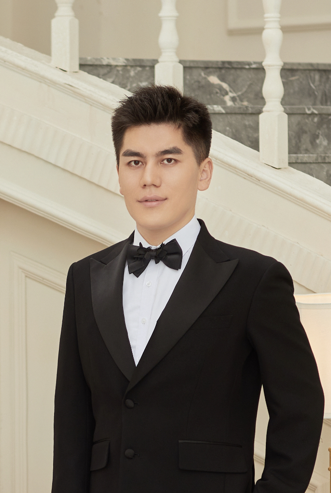

## Li Jiaying
Ph.D. student, [ISTD](https://istd.sutd.edu.sg/), [SUTD](http://www.sutd.edu.sg/)
Address: S6, 2.716, SUTD, 8 Somapah Rd, Singapore, 487372
Tel: (+65)86851683
Email: lijiaying1989@gmail.com

[Curriculum Vitae](./cv.pdf)

### Research Interests
In general, my research interest is PROGRAM ANALYSIS and SOFTWARE ENGINEERING. 
Currently I work on the topic to find loop invariant for a given program with loops in it, 
which stays at the heart of program verification and also the hardest part in this area.

## Education Background:
* B.E. in College of Software, [Nankai University](http://www.nankai.edu.cn), Tianjin, China, 2007-2011
* Study in [Institute of Computing Technology](http://english.ict.cas.cn/), [Chinese Academy of Sciences](http://english.cas.cn/), Beijing, China, 2011-2013
* Ph.D. in [ISTD](https://istd.sutd.edu.sg/), [SUTD](http://www.sutd.edu.sg/), Singapore, 2013-Now

## Publications
* An Invariant Inference Framework using Active Learning and SVMs  
Li Jiaying [PDF](./PDF/AnInvariantInferenceFrameworkbyActiveLearningandSVMs.pdf)
In [ICECCS 2015](http://iceccs2015.monash.edu.au/2015/index.jsp), Dec 9-12, Gold Coast, Australia

##Project
* IIFrm [homepage](http://iifrm.github.io/)

## Talks
* [Using SVM to learn loop invariant](https://istd.sutd.edu.sg/news-events/event/seminar-series/using-svm-to-learn-loop-invariant/)
  [PDF](./Talks/UsingSVMToLearnLoopInvariant.pdf)
  Li Jiaying
  In ISTD Pillar Seminar '15 , SUTD, Singapore, Sept. 25th, 2015. 